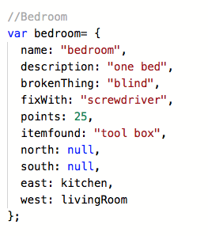
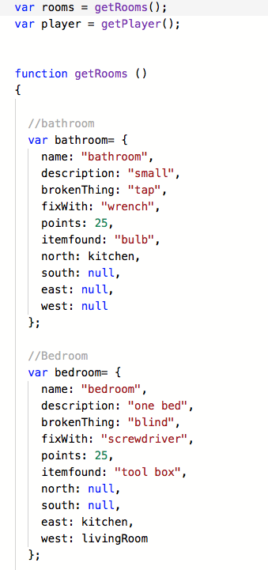
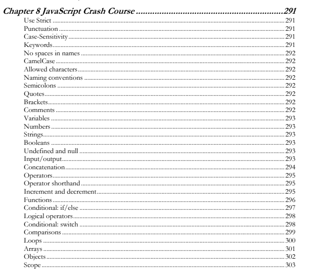
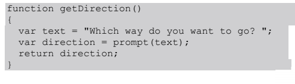

# JavaScript - Room Adventure Game

## Start

On March 15th, I started a litle project in JavaScript language, specifically building the Room Adventure Game. 
***Coding for Kids: Learn JavaScript: Build the Room Adventure Game*** is a creation designed to help teens work through 
programming essentials to build and adapt a game they can play. The book focuses primarily on programming concepts in 
JavaScript, using pop ups to create a text adventure, traveling through a house to fix things. Once the core game is 
complete, we attach it to HTML to create a more visual experience.

Therefore I started with sign up in Rpl.it and with this development environment I started to write my code. The first 
thing that I had to do is the room's objetcs.

## Room's function

On March 22nd, I continued with my project. I started making the room's of my Room Adventure Game so I continued making 
the room's function. In programming is very common work with functions, Objects are encapsulating to re-use in others 
contexts of programming.

Not only that but also I started to make the player Object.

## The base of programming

On April 5th, unfortunately I was sick and I had to stay at home. Despite this, I took the opportunity to read the chapter 8
that it is about some little questions about programming like loops, arrays, operators... These aspects are the basis of 
any programming language.

## Save the code 

On April 19th, at the time of log in in rpl.it I was able to verify that all the work I had previously done had lost it 
due to not saving the file, therefore, it is very important in programming to save any changes made in a project.

## Asking for the directions

On May 3th, I learnead about to ask the player what direction they want to go in. I only needed one function, getDirection(),
prompt()the user  for a direction and if I have a valid direction then send it back using return.

However you have to check the address and check that the room is correct.

## Reading about JavaScript and the blog

The last days of May and the course I was reading about JavaScript and learning the code. It similar to Java but It 
has small differences that should be studied more thoroughly.

## Conclusion

In conclusion about this trismester the practice it was interesting because we had tu study new leguage of programming. 
JavaScript is a common programming language but it also has some features differents from others programming languages. 
We have learned basic thinks about the Javascript but it would be better have more time to learn it.

