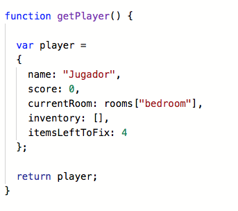

# JavaScript - Room Adventure Game

## Start

On March 15th, I started a litle project in JavaScript language, specifically building the Room Adventure Game. 
***Coding for Kids: Learn JavaScript: Build the Room Adventure Game*** is a creation designed to help teens work through 
programming essentials to build and adapt a game they can play. The book focuses primarily on programming concepts in 
JavaScript, using pop ups to create a text adventure, traveling through a house to fix things. Once the core game is 
complete, we attach it to HTML to create a more visual experience.

Therefore I started with sign up in Rpl.it and with this development environment I started to write my code. The first 
thing that I had to do is the room's objetcs.

## Room's function

On March 22, I continued with my project. I started making the room's of my Room Adventure Game so I continued making 
the room's function. In programming is very common work with functions, Objects are encapsulating to re-use in others 
contexts of programming.

Not only that but also I started to make the player Object.

